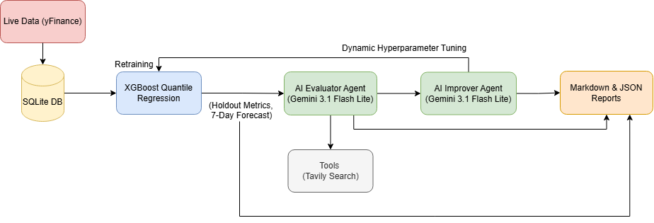

# Adaptive Forecast Agent 

An end-to-end automated pipeline that ingest live time series data, generates predictions, and uses an AI agent to evaluate, interpret, and act on those predictions.

# System Architecture

<p>  </p>

# Core Components

## 1. Live Data Ingestion

* Source: Financial markets via `yfinance`
* Storage: Local lightweight sqlite3 database.
* Cleaning: Handles missing and duplicate values, and dynamically generates lag features.

## 2. Forecasting Model (XGBoost Quantile Regression) 

* Holdout Evaluation: Splits data 80/20 to calculate strict holdout metrics (MAE, RMSE, MAPE).
* 7-Day Forecast Horizon: Predicts the next 7 days iteratively by rolling the data window forward.
* Confidence Intervals: Utilizes multi-objective quantile regression to output the Median point forecast alongside 80% and 95% Confidence Intervals to measure uncertainty.

## 3. AI Evaluator Agent

Built using modern `langchain` and `langchain-google-genai` tool-calling agents. It autonomously executes 5 distinct tasks:

* Evaluate: Reviews the full 7-day predicted trajectory to see if the slope and confidence intervals are realistic.
* Diagnose: Analyzes the Holdout Set metrics to detect over/underfitting.
* Contextualize: Uses the Tavily Web Search Tool to fetch real-world news explaining volatility.
* Recommend: Outputs a strict decision to trust, adjust, or retrain the model.
* Report: Generates a structured JSON payload, a human-readable Markdown analysis, and proof of search (if web search used).


## 4. Continuous Improvement & Reporting

* Improver Agent: Intercepts the Evaluator's JSON report. If retraining is recommended, it suggests new XGBoost hyperparameters (e.g., altering n_estimators or max_depth to handle high volatility).
* Hot-Swapping: The pipeline automatically re-instantiates the XGBoost model with the new parameters, retrains, and generates an updated forecast.
* Outputs: Daily runs are saved in the reports/ directory.


# Local Setup

## 1. Prerequisites

* Python 3.10+
* `uv` package manager

Install uv:

```bash
pip install uv
```

## 2. Installation

```bash
uv venv
source .venv/bin/activate
# Windows:
# .venv\Scripts\activate

uv pip install -e .
```

## 3. Environment Variables

Create environment configuration:

```bash
cp .env.example .env
```

Add your API keys:

```env
GOOGLE_API_KEY=your_gemini_api_key
TAVILY_API_KEY=your_tavily_api_key
```

## 4. Run the Pipeline

```bash
python main.py
```

Generated reports will appear inside:

```text
reports/
```

# Deployment & Automation (CI/CD)

The project is fully containerized and production-ready.

## GitHub Actions Workflow

The system automatically:

* Pulls fresh data daily
* Builds Docker containers
* Executes the forecasting pipeline
* Commits reports back into the repository

## Setup Steps

### 1. Push Repository to GitHub

Preferably a private repository.

### 2. Configure GitHub Actions Permissions

Go to:

```text
Settings -> Actions -> General
```

Enable:

```text
Read and write permissions
```

### 3. Add Repository Secrets

Go to:

```text
Settings -> Secrets and variables -> Actions
```

Add:

```text
GOOGLE_API_KEY
TAVILY_API_KEY
```

### 4. Enable Automation

The workflow will automatically run daily at Midnight UTC.

# Docker Support

Build container:

```bash
docker build -t adaptive-forecast-agent .
```

Run container:

```bash
docker run --env-file .env -v "${PWD}/reports:/app/reports" adaptive-forecast-agent
```

---

# Tech Stack

| Layer            | Technology            |
| ---------------- | ----------------      |
| Forecasting      | XGBoost               |
| AI Agents        | LangChain             |
| LLM              | Gemini 3.1 Flash Lite |
| Web Search       | Tavily                |
| Database         | SQLite                |
| Automation       | GitHub Actions        |
| Packaging        | uv                    |
| Containerization | Docker                |